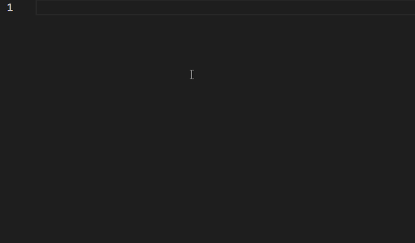

# Karate Snippets for VSCode

This extension adds snippets for Karate DSL.\
Helps writing tests easy and fast, as there is no intellisense with Karate.

## Features

- Support for most used Karate Core (UI) actions

## Snippets

|                 Prefix | Example                                                      |
| ---------------------: | ------------------------------------------------------------ |
|              `kclear→` | `clear("locator")`                                           |
|              `kclick→` | `click("locator")`                                           |
|       `kdeleteCookie→` | `deleteCookie("cookieName")`                                 |
|          `kdriverUrl→` | `driver "url"`                                               |
|                `kex1→` | _Examples Table - 1 Column_                                  |
|                `kex2→` | _Examples Table - 2 Column_                                  |
|                `kex3→` | _Examples Table - 3 Column_                                  |
|                `kex4→` | _Examples Table - 4 Column_                                  |
|            `kfeature→` | _Feature, Background and Scenario_                           |
|              `kfocus→` | `focus("locator")`                                           |
|              `kinput→` | `input("locator", "string")`                                 |
|     `kmatchAttribute→` | `match attribute("locator", "attribute") == "expectedValue"` |
|                `klog→` | `* print "variable:" variable`                               |
|       `kmatchEnabled→` | `match enabled("locator") == true`                           |
|          `kmatchText→` | `match text("locator") contains "expectedText"`              |
|         `kmatchValue→` | `match value("locator") == "expectedValue"`                  |
|        `kmatchExists→` | `match exists("locator") == false`                           |
|           `ksetValue→` | `value("locator", "value")`                                  |
|             `kscroll→` | `scroll("locator")`                                          |
|        `kscrollClick→` | `scroll("locator").click()`                                  |
|        `kscrollInput→` | `scroll("locator").input("text")`                            |
|        `kselectLabel→` | `select("locator", "{}label")`                               |
|        `kselectValue→` | `select("locator", "value")`                                 |
|        `kselectIndex→` | `select("locator", index)`                                   |
|            `kwaitFor→` | `waitFor("locator")`                                         |
|     `kwaitForEnabled→` | `waitForEnabled("locator")`                                  |
|         `kwaitForUrl→` | `waitForUrl("url")`                                          |
|        `kwaitForText→` | `waitForText("locator", "expectedText")`                     |
| `kwaitForResultCount→` | `waitForResultCount("locator", amount)`                      |
